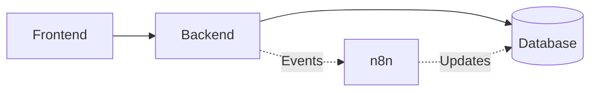

# AutoNexis

Built to demonstrate real-world backend patterns like resilience, async workflows, and fault tolerance.

## Architecture




*(Text representation)*
```text
Frontend → Backend → DB  
        ↘ n8n ↗
```

## Core Features

- **Event-Driven Architecture**: Highly decoupled services responding to domain events, ensuring flexibility and scalability.
- **Asynchronous Processing Using n8n**: Offloading heavy, long-running, and complex workflows to an n8n automation engine.
- **Retry Mechanism with Exponential Backoff**: Ensuring temporary service failures or network glitches do not cause data loss or silent failures.
- **Dead Letter Queue (DLQ) for Failed Events**: Capturing and storing permanently failed events for later manual inspection and debugging.
- **Logging System for Observability**: Comprehensive, structured logging across services for tracking the flow of data and diagnosing issues easily.

## Project Structure

- `/frontend` - The user-facing web application.
- `/backend` - The core API server handling requests, event ingestion, and retry/DLQ logic.

## Getting Started

### Prerequisites
- Node.js (v18+)
- Database (managed via Prisma)
- Running n8n instance

### Backend Setup

```bash
cd backend
npm install
npx prisma generate
npx prisma db push # or npx prisma migrate dev
npm run dev
```

### Frontend Setup

```bash
cd frontend
npm install
npm run dev
```

---
*This repository serves as a practical demonstration of advanced backend engineering concepts.*
